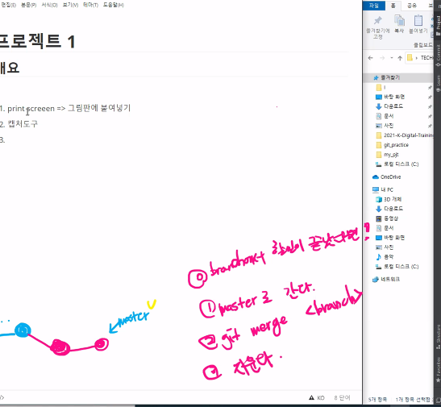

# 데이터 분석 프로젝트 1

# Project TODO List

1. 프로젝트 폴더(디렉토리)를 만든다
2.  .gitignore와 README.md 파일을 생성
   1. .gitignore 파일은 git 의 파일 관리에서 무시할 내용을 
   2. README.md 는 프로젝트 설명

3. $ git init 을 한다

4.  **주의**

   1.  .git 폴더와 .gitignore 파일과 Readme.md가 같은 위치에 위치해야함

5. 첫번째 commit 을 한다

   

   

## New branch

1. 브랜치 생성: git branch '이름'

2. 브랜치 삭제: git branch -d '실험'

3. 브랜치 변경: git switch '실험'

4. 브랜치 확인: git branch

5. 브랜치 통합: git merge '실험'

6. 브랜치 추가 및 변경: git switch -c '실험'

   

## ERROR 발생

1. Switch master

2. touch sos.py

3. add . && commit -m 'msg'

   

## ERROR 후 Branch 합치기

1. switch master
2. merge 
3. branch -d 

## 그래프 그리기

git log --oneline  --graph

## commit msg 수정

1. git commit --amend 

2. 파이참  하단 > git >F2

